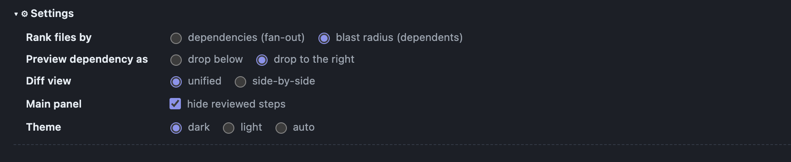

# Codebook

We're all drowning in AI generated code nowadays. The default review flow in 
tools like github sort files alphabetically and by folder structure. This means
that when reviewing a large diff, you end up reading a bunch of irrelevant code
first. 

Codebook structures a diff into a more logical reading order, and allows you to
click through and understand the connection between the entities better. It's 
been extremely useful for me, so I hope you like it. 


_Try reading the same PR on Github [networkx PR #8406](https://github.com/networkx/networkx/pull/8406/files)_

## How it works

Codebook uses [`sem`](https://github.com/Ataraxy-Labs/sem) (tree-sitter under the
hood) to extract the changed code entities and the dependency edges between them,
then computes a **deterministic topological sort** of that graph (Tarjan SCC →
condensation → Kahn with a priority tiebreak). Dependencies are ordered before
their dependents; cycles (mutual recursion, circular imports) collapse into
clusters you read as a unit.

Because it's built on static analysis, codebook is only as good as what
tree-sitter can resolve: it misses what it can't see statically — dynamic
dispatch, runtime wiring, reflection, framework "magic" (e.g. Rails-style
associations) often produce no edge at all. Treat the reading order as a strong
hint, not the ground truth.

## Requirements

| Tool | Needed for | Install |
|---|---|---|
| **Node.js 20+** + **npm** | running codebook (and the installer uses them) | [nodejs.org](https://nodejs.org) · `brew install node` |
| **git** | everything except the built-in `--fixture` examples (repo root, diffs, PR worktrees) | usually preinstalled · `brew install git` |
| **sem** | real diffs / PRs / `--tree` — the diff + dependency-graph backend | `curl -fsSL https://raw.githubusercontent.com/Ataraxy-Labs/sem/main/install.sh \| sh` · `brew install sem-cli` · `npm i -g @ataraxy-labs/sem` |
| **gh** (GitHub CLI) | **only** the `codebook <PR-number>` form | [cli.github.com](https://cli.github.com), then `gh auth login` |

`node` + `npm` + `git` are the baseline; `sem` is required for anything beyond
the bundled examples; `gh` is needed *only* to review a PR by number. codebook
checks for each tool when it actually needs it and tells you exactly what's
missing (e.g. `--working` never asks for `gh`).

**Ranking (Settings panel):** within the dependency order, file groups sort by
one of two lenses. **Fan-out** (default) puts files that depend on the most
first — this tends to surface tests, a quick way to see how data flows. **Blast
radius** puts the files that the most other code depends on first — this surfaces
load-bearing code, but can over-emphasize small helper functions.



## Quick start

Install it (needs `git`, `node` 20+, `npm`, and `sem` for real diffs — see
[Requirements](#requirements)):

```bash
curl -fsSL https://raw.githubusercontent.com/0x007BA7/codebook/main/install.sh | bash
```

Then point it at **your own code** — `cd` into any repo on your machine and run
it (`cb` is a built-in short alias for `codebook`):

```bash
cd ~/projects/my-app
codebook --working    # your uncommitted changes (no commit, PR, or gh needed)
cb              # the current branch vs its base
cb 1234               # `cb` == `codebook`; review GitHub PR #1234 (needs gh)
cb --tree src   # read a whole package in dependency order (no diff)
```

It linearizes the change and opens the reading spine in your browser. That's the
whole loop — see [Usage](#usage) for every form and flag.

<sub>**Installer details:** it won't install a toolchain — `git`/`node` 20+/`npm`
must already be present. It clones into `~/.local/share/codebook`, installs
runtime deps with `npm ci --omit=dev` (~37 MB, all prebuilt — **no compile
step**), and symlinks `codebook`/`cb` into `~/.local/bin`. Re-running updates in
place; pin a ref with `CODEBOOK_REF=<branch|tag|sha>`. Uninstall with `rm -rf
~/.local/share/codebook ~/.local/bin/codebook ~/.local/bin/cb`. Already have a
clone? Skip the curl line and run `make install` in it instead — that leaves the
source in your clone and just symlinks `codebook`/`cb` onto your PATH (no
`~/.local/share` copy). No `sem` yet? `codebook --fixture rate-limit` shows the
UI on a bundled example, offline.</sub>

## Usage

Run `codebook` (or the short `cb` alias) from inside any git checkout. Every form:

```bash
codebook 1234                       # a GitHub PR by number (reads the base from GitHub)
cb --working                  # uncommitted changes vs HEAD — no PR/gh
cb --staged                   # only staged changes
cb --working --watch          # live-reload server: re-renders as you edit
cb --tree [path]              # a whole dir/package in dependency order (no diff)
cb                            # current branch vs its base (no PR #)
cb --base origin/main --head HEAD
cb <repo-dir>                 # a checkout elsewhere
cb --fixture rate-limit       # built-in example, no sem/gh needed
cb 1234 --out review.html     # write the HTML to a file instead of a temp file
```

For the PR-number form, `codebook` reads the PR's base from GitHub, diffs
`merge-base..HEAD`, linearizes, and opens the spine. `--working`/`--staged`
review your local changes with no commit, PR, or `gh` — and they're fast on
re-runs since `sem`'s index stays warm in your repo.

**Where the output goes:** by default the spine is written to a temp file
(`$TMPDIR/codebook-<repo>-<scope>.html` — on macOS that's under `/var/folders/…`,
which the OS purges periodically) and opened in your browser. Pass `--out
<file>` to write it somewhere you'll keep, or `--no-open` to just write the file
without launching a browser.

<details>
<summary>How it talks to <code>sem</code>, and what it reads</summary>

The adapter (`packages/ingest/src/sem.ts`) runs `sem diff --from <base> --to
<head> --json` for the changed entities (with real code as patch text) and `sem
graph --json` for the dependency edges, then normalizes both into a `GraphInput`.
It reads a **local checkout** and never posts back. `orphan`/module-level
entities are dropped; only edges between two *changed* entities affect the
reading order (edges to unchanged code are dropped by design, §3).
</details>


## Optional: server + web app

A small HTTP server and web UI ship with the repo as a quick way to view the UI. It's secondary to the `codebook` CLI — most people won't need it. I might build useful functionality on top of it in the future. 
Run `make serve` (or `make demo` to open the bundled fixture).

<details>
<summary>HTTP API + low-level CLI</summary>

```
GET  /api/health                          -> { ok: true }
GET  /api/reading-plan?fixture=<name>     -> ReadingPlan
POST /api/reading-plan                    -> ReadingPlan
       body: { fixture } | { repo, base, head, ingestor?: "sem" | "fixture" }
GET  /api/fixtures                        -> { fixtures: string[] }
```

The `codebook` launcher wraps `packages/cli/src/main.ts`; you can also call its
`plan`/`render` subcommands directly:

```bash
npx tsx packages/cli/src/main.ts plan --fixture rate-limit
```
</details>

## Developing

Working on Codebook itself:

```bash
make verify    # the gate: typecheck + lint + all tests (offline, no sem/gh)
make eval      # linearize every fixture -> eval/report.html
make demo      # server + web on the rate-limit fixture
```

`make verify`/`make eval` need no external binaries; the `sem` integration tests
auto-skip when `sem` isn't installed (so they don't run in that path).

## Nota Bene

This is a mostly vibecoded project. I've been using it pretty extensively in my own 
personal work, but it comes with all the hairiness of extensively AI coded projects. 
